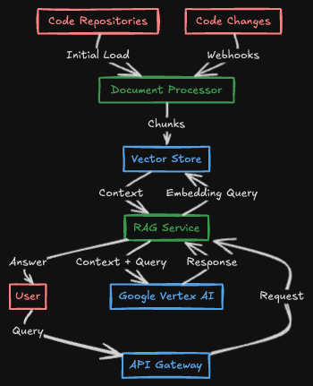

# rag-genai-example

Exaple project for demonstration of a RAG-capable generative AI system.

Vector store will be loaded with collection of javascript code source files, then the questions will be answered within the vector store context. Any question outside the context will be evaluated as unknown knownledge.

## High-Level Architecture



## Key Compenents

1. Document Processing Pipeline
   - Code repository parser
   - Text chunking system
   - Embedding generation (Google Vertex AI embedding models)

2. Storage Layer
   - Vector store
     - Google Vertex AI Vector Search
     - ChromaDB (for local development)

3. RAG Service
   - API Gateway (Cloud Run)
   - RAG orchestrator (Langchain graph)
   - Context retrieval system
   - Google Vertex AI integration for LLM

## Building

### Install `uv`

How to install [`uv`](https://docs.astral.sh/uv/getting-started/installation/#standalone-installer)

Create a new virtual environment using `uv`:

```shell
uv venv .venv
```

Activate virtual environment

```shell
source .venv/bin/activate
```

### Install dependencies

```shell
uv pip install -e .
```

## Running

Run FastAPI server

```shell
uvicorn src.app:app
```
